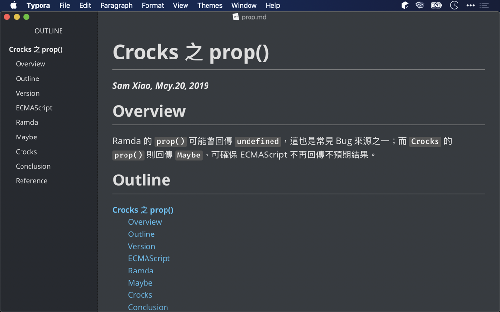
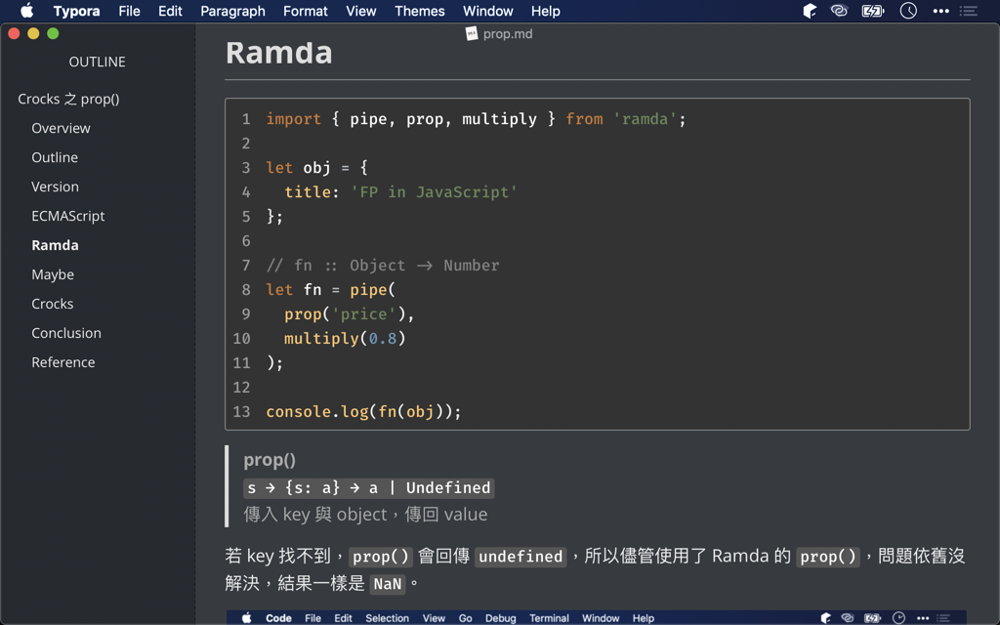
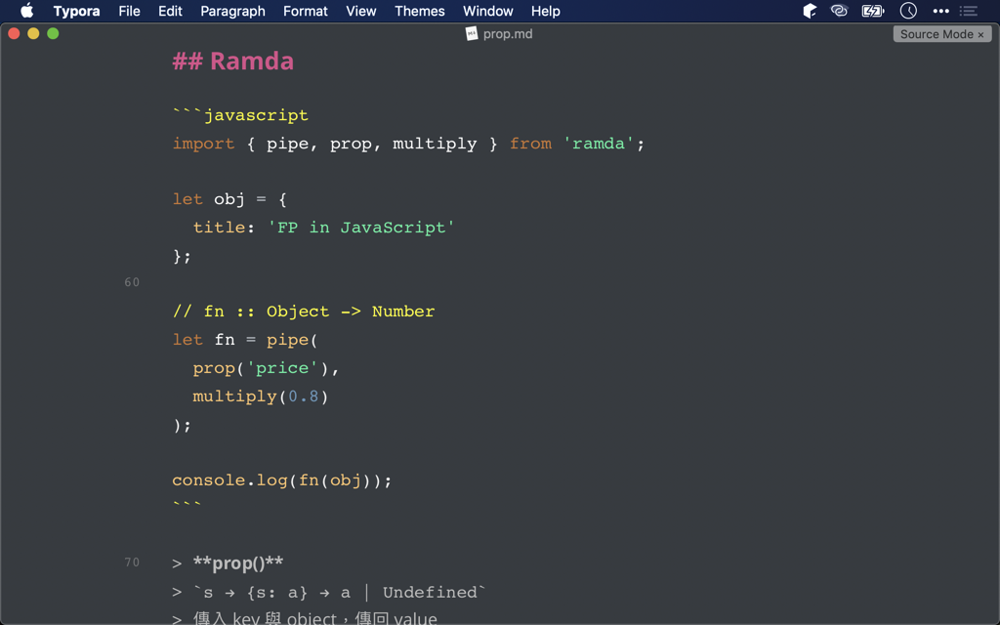
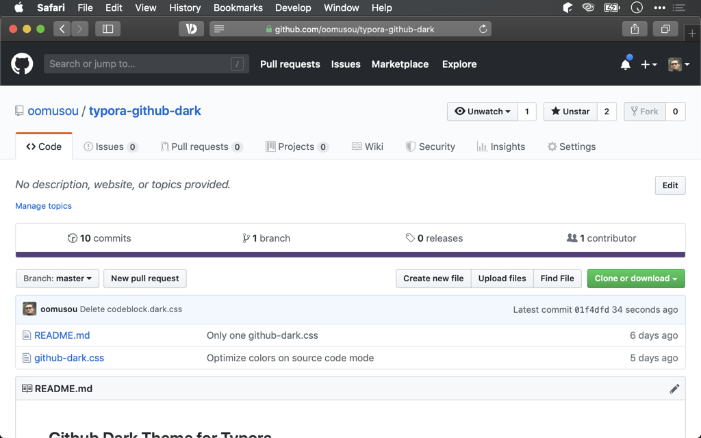
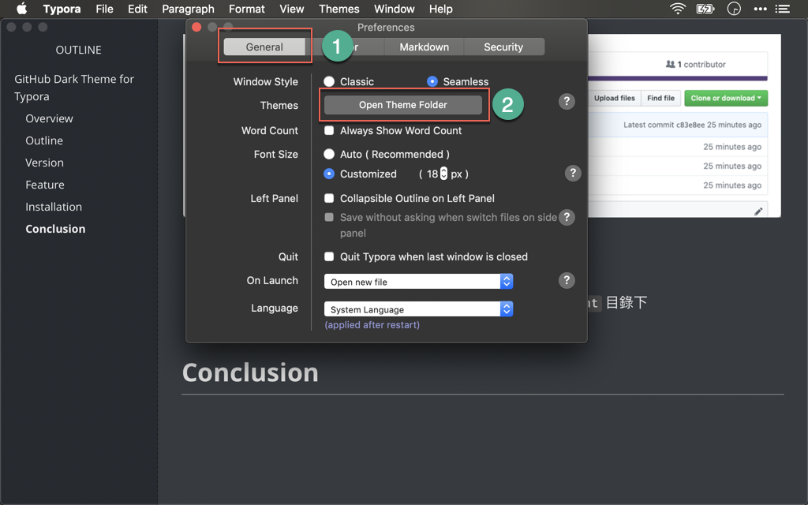
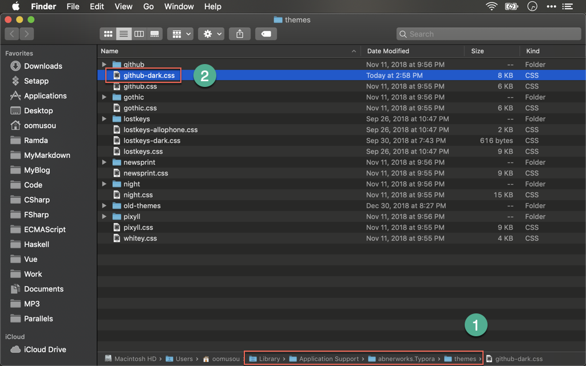
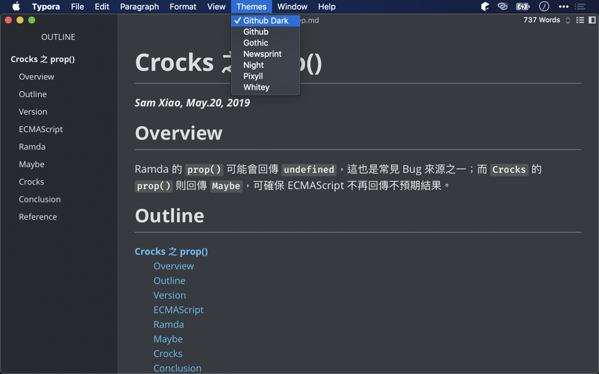

# GitHub Dark Theme for Typora

## Overview

Since macOS Mojave support dark mode, I've switched all my apps to dark mode. The only app not on dark mode is Typora. Although there are many dark mode themes support Typora, I didn't find any one I like. So I made this one. The best feature is to support `Fira Code` and `JetBrains Darcula`  theme for code snippet .

## Version

GitHub Dark Theme 0.1.1

## Feature

* All dark mode, the color for left side is darker than right side
* The color for content is not totally black, because too deep black is not good for long time reading

## Code

* Font family for code snippet is `Fira Code`
* Color theme for code snippet is `JetBrains Darcula`

## Source Mode

* Better contrast color on markdown source mode

## Installation

* Download `github-dark.css` from [oomusou/typora-github-dark](https://github.com/oomusou/typora-github-dark)

***Typora -> Preferences -> General -> Open Theme Folder***

* Put `github-dark.css` in the default theme directory： `~/Library/Application Support/abnerworks.Typora/themes`

* Restart Typora, you will see `GitHub Dart` on `Themes` menu

## Reference

[Sayrus](https://github.com/Sayrus/typora-github-dark), [GitHub Dark Theme for Typora](https://github.com/Sayrus/typora-github-dark)
